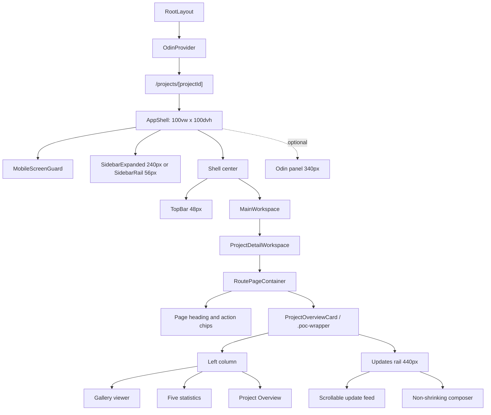
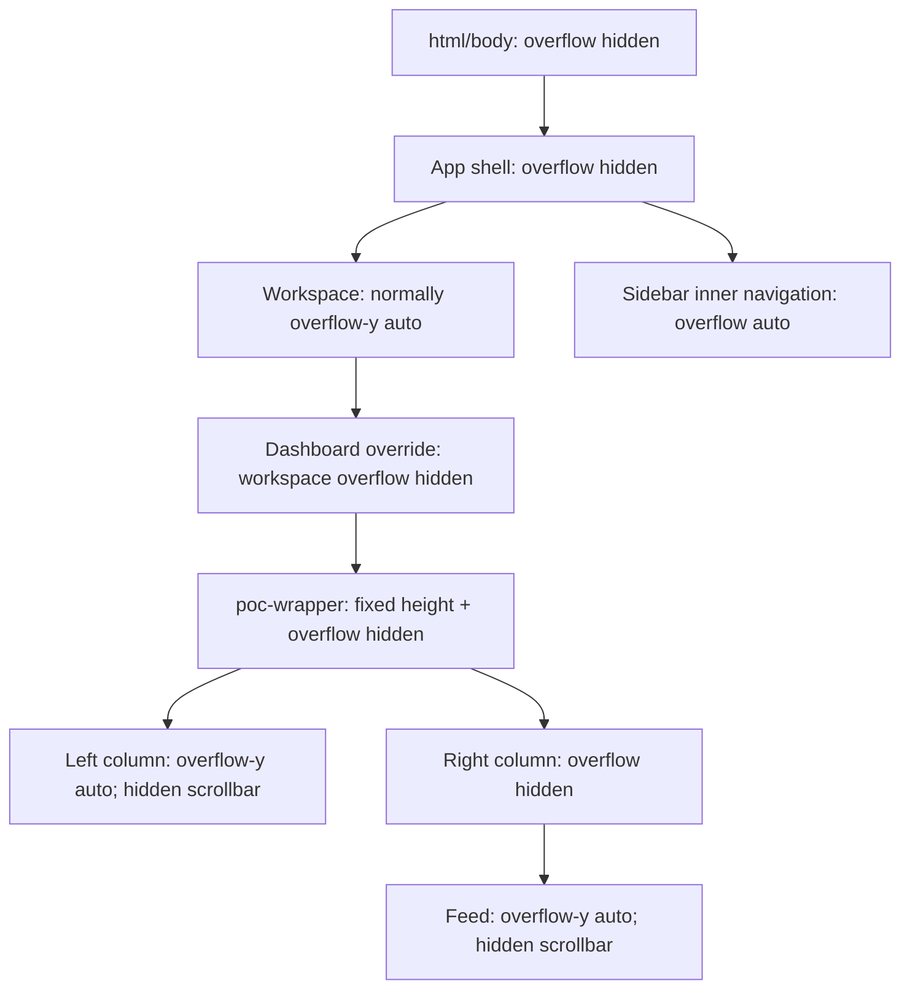
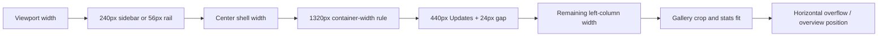
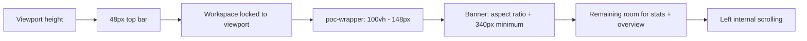
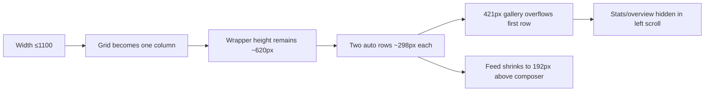

# Kallisto Project Dashboard Responsive UI and Layout Audit

Audit date: 31 July 2026  
Target route: `http://127.0.0.1:3000/projects/proj-001`  
Scope: application shell plus the complete visible individual-project dashboard  
Mode: audit only; no production component, style, route, or test file was modified

## 1. Executive summary

The dashboard is visually coherent at 1920×1080 and 1680×1050, but it does not scale continuously through common laptop and tablet widths. The failures come from a combination of page-layout, breakpoint, and scroll-ownership rules:

- the Updates rail remains exactly `440px` wide until the whole dashboard stacks;
- the page wrapper is height-locked to `calc(100vh - 148px)` and hides overflow;
- the gallery retains a `340px` minimum height on short laptops and becomes `421px` tall after stacking at 1024×768;
- the statistics grid changes columns according to the viewport (`1200px`), not the width of its actual left-column container;
- the page uses hidden, independently scrolling subregions rather than one obvious content scroll;
- three breakpoint cliffs at 1320, 1160, and 1100 pixels cause abrupt, non-proportional changes.

No P0 defect was confirmed: content hidden from the initial viewport could still be reached by scrolling the correct internal pane. Five P1 defects were confirmed on common laptop/tablet sizes. The most severe visible failure is at 1024×768, where the single-column dashboard is still constrained to a two-row, fixed-height grid; the gallery consumes more than the first row, the statistics and overview begin inside a hidden internal scroll region, and the Updates feed is reduced to a 192px scroll viewport.

Confirmed issues: **15**  
Suspected risks: **6**  
P0: **0**  
P1: **5**  

The reported perception that the sidebar and content are “larger” on some laptops is not caused by responsive font-size changes in the tested range. Computed type sizes remained stable. It is caused primarily by fixed-size shell and page regions occupying a larger percentage of smaller viewports, together with compressed main-column width and a height-insensitive hero.

### Audit health score

| Dimension | Score | Summary |
|---|---:|---|
| Accessibility | 2/4 | Focus suppression, small controls, low-contrast date text, and incomplete composer labelling |
| Performance/layout stability | 3/4 | Local Next images and loaded fonts behaved stably; duplicated CSS and large monolithic UI increase drift risk |
| Responsive behavior | 1/4 | Major failures at 1366, 1280, and 1024 widths |
| Theming/visual system | 1/4 | Global tokens exist, but this page hard-codes many colors and dimensions |
| Anti-pattern resistance | 3/4 | Restrained visual language, but fixed layout values and duplicated rules weaken maintainability |
| **Total** | **10/20** | Acceptable only at larger desktop sizes; significant responsive work is required |

## 2. Components inspected

| Layer/component | File | Parent | Layout and sizing | Overflow/position | Responsive behavior |
|---|---|---|---|---|---|
| `RootLayout` | `app/layout.tsx` | Next.js root | Document shell; loads Hanken Grotesk through global CSS | Document is later height-locked globally | None in component |
| `ProjectPage` | `app/projects/[projectId]/page.tsx` | App Router | Composes `AppShell` and `ProjectDetailWorkspace` | Route loading state uses `.workspace-container` | Dynamic project route |
| `AppShell` | `components/layout/app-shell.tsx:23-176` | Route | CSS grid: sidebar + center; optional Odin column | Shell is `100vw × 100dvh`, `overflow:hidden` | JS `matchMedia("(max-width: 1160px)")` at lines 64-77 |
| `SidebarExpanded` / `SidebarRail` | `components/layout/sidebar-expanded.tsx`, `components/layout/sidebar-rail.tsx` | `AppShell` | Fixed 240px expanded or 56px rail token | Inner navigation owns scroll; footer/bottom controls remain outside it | Expanded sidebar replaced by rail at 1160px |
| `TopBar` | `components/layout/topbar.tsx` | `AppShell` | Fixed 48px grid row; flexible breadcrumbs/search/actions | Center shell clips overflow | Search width changes at 1320px; hidden at 900px |
| `MainWorkspace` | `components/layout/main-workspace.tsx:9` | `AppShell` | `<main class="workspace">` | Normally scrollable; forced to hidden overflow for `.poc-wrapper` | Page-specific `:has()` rules |
| `ProjectDetailWorkspace` | `features/projects/project-detail-workspace.tsx:18-80` | Route | Loads project, then mounts one overview composition | Loading/error states are separate | Accepts `activeTab`, but does not use it |
| `RoutePageContainer` | `components/ui/route-page-container.tsx:31-149` | `ProjectDetailWorkspace` | `.workspace-container` + heading + `.route-content-wrap` | Container is height-locked and clipped when it contains `.poc-wrapper` | Heading stacks at 1080px |
| `DocumentsTitleRowActions` | `features/documents/components/documents-title-row-actions.tsx:29-70` | `RoutePageContainer` heading | Inline, non-wrapping navigation chips | No independent scroll | Remains visible at all audited widths |
| `ProjectOverviewCard` | `features/documents/components/project-overview-card.tsx:316-838` | `RoutePageContainer` | Monolithic two-column grid; also owns feed and composer | Left, feed, and shell can each own scroll | Stacks at 1100px |
| `ProjectGallery` | `features/documents/components/gallery/project-gallery.tsx:13-27` | Left column | Only renders `ProjectGalleryViewer`; imported thumbnail rail is not mounted | Viewer clips image | Width/height governed globally |
| `ProjectGalleryViewer` | `features/documents/components/gallery/project-gallery-viewer.tsx:12-73` | `ProjectGallery` | Width 100%; aspect ratio plus min/max heights | Relative frame, absolute image/control overlay; `overflow:hidden` | Min-height falls from 360 to 340px at 1400px |
| `ProjectStatCardsBar` | `features/documents/components/project-stat-cards-bar.tsx:22-87` | Left column | Five-column grid with static mock values | Can enlarge parent scroll width | Changes to three columns only at viewport ≤1200px |
| `ProjectOverviewSection` | `features/documents/components/project-overview-section.tsx:6-55` | Left column | Collapsible block below stats | Part of left internal scroll region | No height-aware behavior |
| Updates feed | Embedded in `project-overview-card.tsx:523-595` | Right column | Flex column of three mock post cards | `.poc-sections-card` is independently scrollable | Fixed 440px rail until 1100px stack |
| Update composer | Embedded in `project-overview-card.tsx:598-834` | Right column | Non-shrinking flex item below feed | Relative; does not overlap feed | Keeps permanent height across viewports |

The current Updates panel is not a separate page component. A separate modular project-updates feature exists elsewhere in the repository, but the audited route mounts the embedded implementation above. It must not be treated as proof of the current route behavior.

## 3. Layout architecture diagram

## 4. Scroll ownership diagram

At 1366×768 and both 1280 widths, the user can encounter three active scroll owners: sidebar navigation, the left project column, and the Updates feed. At 1024×768, the dashboard still has two independent content scroll owners despite becoming a single visual column. Full-page screenshots remain viewport-sized because the document itself never scrolls.

## 5. Shared tokens and responsive logic

Global tokens in `app/globals.css:3-24`:

- sidebar expanded: `240px`
- sidebar rail: `56px`
- top bar: `48px`
- Odin panel: `340px`
- workspace max token: `1120px`
- light-only color scheme
- radii: 8, 12, and 16px

The project dashboard frequently bypasses the color and sizing tokens with direct hexadecimal colors and fixed dimensions.

### Breakpoint inventory

| Breakpoint | Source | Behavior | Audit assessment |
|---|---|---|---|
| `min-width:1161px` | `app/globals.css:107-115` | Odin becomes a third 340px shell column | Suspected risk when open; not part of the default captured state |
| `max-width:1400px` | `app/globals.css:3012-3029` | Viewer minimum height changes 360→340px | Height changes, but composition remains width-driven |
| `max-width:1320px` | `app/globals.css:1607-1614` | Workspace container becomes `calc(100% - 48px)` | Creates a 49px one-pixel breakpoint loss at 1321→1320 |
| `max-width:1200px` | `app/globals.css:2563-2567` | Stats become three columns | Fires too late for a 454–588px left column at wider viewports |
| `max-width:1160px` | CSS at `1616-1627`; JS at `app-shell.tsx:64-77` | Expanded sidebar becomes rail | Releases about 183px abruptly; CSS and JS duplicate the same threshold |
| `max-width:1100px` | `app/globals.css:3032-3040` | Dashboard grid becomes one column; right max-height 400px | Catastrophic with the existing fixed-height wrapper |
| `max-width:1080px` | `app/globals.css:882-888` | Heading becomes a vertical flex column | Increases heading height inside a height-locked page |
| `max-width:900px` | `app/globals.css:1653-1660` | Search hidden; container width/padding changes | Below required test range; compounds vertical pressure |
| `max-width:760px` | `app/globals.css:1690-1708` | Breadcrumbs hidden and rail shrinks | Below required test range |
| `max-width:639px` | `app/globals.css:1812-1844` | Full-screen mobile guard blocks application | Intentional current product behavior, not tested as dashboard layout |

Breakpoint probes at 768px viewport height confirmed the discontinuities:

| Width transition | Observed change |
|---|---|
| 1321→1320 | container 1055→1006px; left project column 543→494px |
| 1161→1160 | sidebar 240→56px; left project column 335→518px |
| 1101→1100 | two columns become two equal-height stacked rows inside the same 620px wrapper |

## 6. High-risk layout rule inventory

| Status | Rule | Source | Component | Risk/effect |
|---|---|---|---|---|
| Confirmed | `width:100vw; height:100dvh; overflow:hidden` | `app/globals.css:88-100` | App shell | Makes all reachability depend on internal scroll ownership |
| Confirmed | `html, body { max-height:100dvh; overflow:hidden; }` | `app/globals.css:31-38` | Document | Full-page scrolling cannot recover clipped child content |
| Confirmed | `grid-template-columns:240px minmax(0,1fr)` | `app/globals.css:88-105` | App shell | Fixed sidebar takes 18.75% of a 1280px viewport |
| Suspected | optional third `340px` Odin column | `app/globals.css:107-115` | App shell | Can further compress an already narrow center at desktop widths |
| Confirmed | workspace height `calc(100vh - 56px)` + hidden overflow | `app/globals.css:833-856` | Workspace/container | Transfers scrolling from page to nested child regions |
| Confirmed | `.poc-wrapper` columns `1fr 440px` | `app/globals.css:2522-2533` | Dashboard | Fixed secondary rail starves primary content |
| Confirmed | `.poc-wrapper` height `calc(100vh - 148px)` | `app/globals.css:2530-2533` | Dashboard | Ignores actual heading changes and content needs |
| Confirmed | left column `height:100%; overflow-y:auto` | `app/globals.css:2542-2551` | Main project column | Creates hidden internal vertical/horizontal scrolling |
| Confirmed | stats `repeat(5,1fr)` | `app/globals.css:2555-2561` | Statistics | Cards reach a 665px intrinsic width in narrower left columns |
| Confirmed | stats breakpoint based on viewport, not container | `app/globals.css:2563-2567` | Statistics | Fails at 1366/1280 although the component is only 588/454px wide |
| Confirmed | viewer `aspect-ratio:16/8; min-height:360px; max-height:460px` | `app/globals.css:2928-2937` | Banner | Width and min-height conflict; height dominates short laptops |
| Confirmed | viewer min-height `340px` under 1400px | `app/globals.css:3012-3029` | Banner | Still consumes 47.22% of a 1280×720 viewport |
| Confirmed | stack at 1100px without redefining rows or wrapper height | `app/globals.css:3032-3040` | Dashboard | Produces two ~298px rows at 1024×768 |
| Confirmed | right column `height/max-height:100%; overflow:hidden` | `app/globals.css:3080-3089` | Updates | Requires feed-only scrolling |
| Confirmed | feed `overflow-y:auto` with scrollbar suppressed | `app/globals.css:3091-3102` | Updates feed | Scrolling is functional but invisible |
| Confirmed | composer `flex-shrink:0` | `app/globals.css:3305-3311` | Update composer | Permanently reserves height while feed shrinks |
| Confirmed | textarea `outline:none!important` in all focus states | `app/globals.css:3414-3434` | Composer | Overrides the global keyboard focus rule |
| Confirmed | project controls at 26–32px | `app/globals.css:2964-2976`, `3489-3499`, `3830-3841`, `4024-4034` | Gallery/feed/composer | Below the requested ~40×40 usability target |
| Confirmed | duplicate `.post-media-banner` sizing | `app/globals.css:3104-3114` and `4050-4058` | Update media | Later fixed `height:145px` overrides earlier aspect/min/max intent |
| Suspected | non-wrapping page action chips | `app/globals.css:956-972` | Project action links | Can compete with long project names or localized labels |
| Intentional | mobile-screen guard below 640px | `app/globals.css:1812-1844` | Entire application | Explicitly prevents mobile dashboard use |

No CSS `zoom` or viewport-based font sizing was found on this path. The gallery applies `transform:scale()` only for the user-controlled zoom feature; it is not a responsive scaling mechanism. Important grid/flex children generally have `min-width:0`, so the dominant failures come from fixed siblings, intrinsic card widths, and breakpoint timing rather than a missing generic shrink reset.

## 7. Automated viewport test matrix

Browser zoom was 100%. All viewport and full-page screenshots were captured from the live route. DOM measurements are retained in `project-dashboard-responsive/dashboard-measurements.json`.

| Viewport | Sidebar | Dashboard container | Main left | Updates | Banner height (% viewport) | Overview initially visible | Feed client/scroll height | Active scroll owners | Result |
|---|---:|---:|---:|---:|---:|---|---:|---:|---|
| 1920×1080 | 240 | 1654 | 1142 | 440 | 460 (42.59%) | Yes, fully | 826/826 | 0 | Pass with fixed-width imbalance risk |
| 1680×1050 | 240 | 1414 | 902 | 440 | 449 (42.76%) | Yes, fully | 796/796 | 0 | Pass |
| 1536×864 | 240 | 1270 | 758 | 440 | 377 (43.63%) | Yes, fully | 610/787 | 1 | Feed begins internal scrolling |
| 1440×900 | 240 | 1174 | 662 | 440 | 360 (40.00%) | Yes, fully | 646/787 | 2 | Two hidden internal scroll regions |
| 1366×768 | 240 | 1100 | 588 | 440 | 340 (44.27%) | Yes, fully | 514/787 | 3 | P1 stats overflow and fragmented scrolling |
| 1280×800 | 240 | 966 | 454 | 440 | 340 (42.50%) | Yes, fully | 546/787 | 3 | P1 compression; main only 14px wider than Updates |
| 1280×720 | 240 | 966 | 454 | 440 | 340 (47.22%) | No; section bottom at ~784px | 466/787 | 3 | P1 short-height failure plus horizontal stats scroll |
| 1024×768 | 56 | 894 | 846 stacked | 846 stacked | 421 (54.82%) | No; starts around 685px inside 298px row | 192/731 | 2 | P1 stacked-layout and scroll-reachability failure |

For every tested size, `documentElement` and `body` client/scroll dimensions matched the viewport; body-level horizontal and vertical overflow were false. This is not evidence that all content fits. It proves that the shell's hidden-overflow architecture prevents document scrolling while child panes absorb or clip overflow.

### Application shell findings

- Sidebar width stays 240px from 1920 through 1280, then switches to 56px at 1024.
- Sidebar navigation rows remain 32px high with 13px text. The type is not scaling up.
- At 1366 and both 1280 heights, the sidebar's inner navigation scrolls while footer actions remain visible.
- The top bar remains 48px high. No overlap was measured at the eight required viewports.
- Search stays 360px wide at 1024 and is hidden only at ≤900. It compressed to about 299px at the 1161px probe.
- Full and viewport screenshots have the same document extent because the document is height-locked.

### Main/Updates proportions

- Updates occupies 22.9% of 1920px, 32.2% of 1366px, and 34.4% of 1280px.
- At 1280px, the main left column is 454px and the Updates rail is 440px: the primary and secondary regions are nearly equal despite unequal information priority.
- At 1366px the five statistics need 665px but receive 584px of client width. Their fifth item extends to about x=946 while the left column ends around x=869 and Updates starts around x=893.
- At 1280px the left column again needs 665px but receives about 450px of client width. A hidden horizontal scroll reaches 211px.
- At 1024px the three-column stat rule finally activates and removes horizontal overflow, but the containing first row is only about 298px high while the banner alone is 421px.

## 8. Confirmed defects

### RSP-001 — Fixed Updates rail starves the primary project area

- Severity/category: **P1 — responsive design defect**
- Affected viewports: 1366×768, 1280×800, 1280×720; pressure begins at 1536×864
- Symptom: Updates remains visually dominant while the banner, metadata, and overview compress into a narrow main column.
- Immediate cause: Updates is always 440px wide in the two-column layout.
- Controlling cause: `.poc-wrapper { grid-template-columns:minmax(0,1fr) 440px; gap:24px; }`.
- Amplifying cause: a fixed 240px sidebar and the 1320px workspace-width rule remove additional center width.
- Structural cause: secondary-panel width is unrelated to available shell or primary-column width.
- Evidence: `app/globals.css:2522-2533`; main/Updates widths are 588/440 at 1366 and 454/440 at 1280.
- Screenshots: `dashboard-1366x768-viewport.png`, `dashboard-1280x800-viewport.png`.
- Confidence: High.
- Correction direction: make width allocation responsive to the available dashboard container and establish a minimum usable main-column width before preserving a side rail.

### RSP-002 — Statistics overflow and cross into the Updates region

- Severity/category: **P1 — technical layout defect**
- Affected viewports: 1366×768, 1280×800, 1280×720
- Symptom: later statistics are clipped or visually occupy space underneath the Updates rail; horizontal scrolling is required to reach them.
- Immediate cause: five stat columns have a measured intrinsic scroll width of 665px.
- Controlling cause: `repeat(5,1fr)` remains active until the viewport reaches 1200px.
- Amplifying cause: the component itself is only 588px at 1366 and 454px at 1280 because the fixed Updates rail has already compressed it.
- Structural cause: responsive behavior is tied to viewport width rather than the component's containing width.
- Evidence: `app/globals.css:2555-2567`; at 1280 the left client/scroll widths are about 450/665px and maximum horizontal scroll is 211px.
- Screenshot: `dashboard-1280x720-stats-horizontal-scroll.png`.
- Confidence: High.
- Correction direction: use container-aware layout behavior or define stat wrapping from the actual minimum card width.

### RSP-003 — The 1100px stack breakpoint creates two undersized fixed rows

- Severity/category: **P1 — responsive design defect**
- Affected viewport: 1024×768; reproduced at the 1101→1100 probe
- Symptom: the first stacked row is about 298px high although its banner is 421px; statistics and overview exist below it inside an internal scroll. The Updates feed receives only 192px above the composer.
- Immediate cause: the grid changes from two columns to one column but retains the fixed wrapper height.
- Controlling cause: `grid-template-columns:1fr` at ≤1100 without resetting height or explicitly defining appropriate rows.
- Amplifying cause: grid auto-placement divides the approximately 620px wrapper into two tracks while both child columns retain their own height/overflow rules.
- Structural cause: a desktop side-by-side composition is stacked without redefining height, flow, or scroll ownership.
- Evidence: `app/globals.css:2522-2533` and `3032-3040`; 1024 screenshot and DOM measurements.
- Screenshots: `dashboard-1024x768-viewport.png`, `dashboard-1024x768-left-scroll.png`, `dashboard-1024x768-feed-scroll.png`.
- Confidence: High.
- Correction direction: let the stacked composition use normal document/content flow or explicitly redesign its row sizing and scroll owner.

### RSP-004 — Height-insensitive banner pushes important content below short viewports

- Severity/category: **P1 — responsive design defect**
- Affected viewports: 1280×720 and 1024×768; near-threshold pressure at 1366×768
- Symptom: Project Overview is not fully visible initially. At 1280×720 the banner alone occupies 47.22% of viewport height; at 1024×768 it occupies 54.82%.
- Immediate cause: the banner holds a 340px minimum height on short laptops and grows to 421px after stacking.
- Controlling cause: the viewer combines width-derived `aspect-ratio:16/8` with fixed min/max heights.
- Amplifying cause: title/banner/stat/overview gaps add approximately 52px plus the statistics and heading.
- Structural cause: responsive behavior considers viewport width but not available viewport height.
- Evidence: `app/globals.css:2928-2937`, `3012-3029`; overview bottom is approximately 784px at 1280×720.
- Screenshots: `dashboard-1280x720-viewport.png`, `dashboard-1024x768-viewport.png`.
- Confidence: High.
- Correction direction: set a height-aware media policy and protect the visibility priority of metadata/overview on short laptop screens.

### RSP-005 — Hidden, fragmented scroll ownership obscures reachable content

- Severity/category: **P1 — usability/scroll architecture defect**
- Affected viewports: 1440×900 through 1024×768; most severe at 1366 and 1280
- Symptom: users must discover that sidebar navigation, the left project column, and Updates feed scroll independently; all relevant scrollbars are hidden. At 1280, a horizontal left-column scroll is also required for stats.
- Immediate cause: multiple descendants use `overflow:auto` while ancestors use `overflow:hidden`.
- Controlling cause: the document, app shell, dashboard workspace, and wrapper are height-locked/clipped; scroll is delegated to left/feed/sidebar children.
- Amplifying cause: scrollbar suppression removes the visible cue identifying each scroll owner.
- Structural cause: page-level content and secondary feed do not have an explicit, consistent scroll hierarchy across breakpoints.
- Evidence: `app/globals.css:31-38`, `88-100`, `833-856`, `2542-2551`, `3091-3102`; three active scroll containers at 1366 and both 1280 tests.
- Screenshots: initial and scrolled 1024/1280 evidence images.
- Confidence: High.
- Correction direction: define one primary page scroll owner; keep a nested feed only if its independent behavior remains necessary and visibly operable.

### RSP-006 — Breakpoint cliffs produce unpredictable width changes

- Severity/category: **P2 — responsive design defect**
- Affected widths: around 1320, 1160, and 1100px
- Symptom: a one-pixel resize can remove 49px, add 183px, or completely recompose the dashboard.
- Immediate cause: multiple large discrete changes occur at close thresholds.
- Controlling cause: the container-width, JS/CSS sidebar, and dashboard-stack rules operate independently.
- Amplifying cause: the fixed 440px Updates rail makes every center-width change disproportionately affect the left column.
- Structural cause: breakpoints are not derived from component minimum widths or a shared responsive contract.
- Evidence: breakpoint probe table in section 5.
- Screenshot evidence: adjacent required screenshots show the progressive effect; probes were DOM-measured.
- Confidence: High.
- Correction direction: consolidate around content-driven thresholds and test the transition intervals, not just standard device widths.

### RSP-007 — Banner cropping changes disproportionately as the main column narrows

- Severity/category: **P2 — visual consistency defect**
- Affected viewports: 1366×768, both 1280 widths, 1024×768
- Symptom: the hero changes from a wide landscape presentation to a strongly cropped, almost square content window at 1280; at 1024 it becomes very tall.
- Immediate cause: `object-fit:cover` fills a frame whose actual ratio is controlled by conflicting aspect/min-height constraints.
- Controlling cause: frame min-height remains 340px even when width falls to about 450px.
- Amplifying cause: the fixed Updates rail forces the frame width down while height stays constant.
- Structural cause: media composition follows local width/min-height rather than a responsive visual-priority rule.
- Evidence: `app/globals.css:2928-2945`; no image distortion was detected, but crop severity changes materially.
- Screenshots: 1920, 1280, and 1024 viewport images.
- Confidence: High.
- Correction direction: preserve an approved responsive crop/focal-point policy without stretching the image.

### RSP-008 — Many interactive controls are below the requested ~40×40 target

- Severity/category: **P2 — usability/accessibility issue**
- Affected viewports: all; most consequential at 1024 tablet use
- Symptom: gallery buttons are 26×26px, top-bar/share controls 28px, send 32px, nav rows 32px, and multiple text/icon controls have even smaller rendered boxes.
- Immediate cause: direct small width/height/padding values.
- Controlling cause: the dense desktop interaction system has no larger touch-target mode.
- Amplifying cause: controls cluster in tight toolbars and overlays.
- Structural cause: visual compactness and hit-area sizing are coupled.
- Evidence: `app/globals.css:274-285`, `757-770`, `923-935`, `2964-2976`, `3489-3499`, `3623-3635`, `3830-3841`, `4024-4034`, `4144-4157`.
- Screenshot evidence: all viewport captures.
- Confidence: High for the requested 40px audit threshold; individual WCAG 2.5.8 assessment requires exact hit-area review per control.
- Correction direction: preserve compact visuals while increasing interactive hit areas and spacing at pointer-coarse/tablet conditions.

### RSP-009 — Composer textarea loses its keyboard focus indicator

- Severity/category: **P2 — accessibility defect**
- Affected viewports: all
- Symptom: keyboard focus on the update textarea has no visible outline, border, or shadow.
- Immediate cause: textarea focus states explicitly set all three indicators to `none!important`.
- Controlling cause: page-specific CSS overrides the global `textarea:focus-visible` outline.
- Amplifying cause: the textarea sits in a white card with no `:focus-within` replacement.
- Structural cause: component styling bypasses the shared focus treatment.
- Evidence: global rule `app/globals.css:68-73`; override `3414-3434`.
- Screenshot evidence: static screenshots do not communicate focus; confirmed from computed/source focus rules.
- Confidence: High.
- Correction direction: restore a visible, token-consistent focus indicator at the textarea or composer-card level.

### RSP-010 — Update date text fails normal-text contrast

- Severity/category: **P2 — accessibility/visual consistency defect**
- Affected viewports: all
- Symptom: 12.5px blue dates are visually weak against white.
- Immediate cause: `#3B82F6` on white measures approximately 3.68:1.
- Controlling cause: the date color is hard-coded.
- Amplifying cause: the text is small and regular weight.
- Structural cause: semantic accent color is used without a text-contrast token.
- Evidence: `app/globals.css:3987-3990`; DOM contrast calculation at the live route.
- Screenshot evidence: Updates rail in all viewport images.
- Confidence: High.
- Correction direction: use a text-safe accent meeting 4.5:1 for normal text or change the date treatment without relying on color alone.

### RSP-011 — Composer controls have incomplete accessible naming

- Severity/category: **P2 — accessibility/usability issue**
- Affected viewports: all
- Symptom: the textarea relies on placeholder text rather than a persistent label; the upload and audience controls rely on `title`/visible value without explicit purpose-oriented accessible labels.
- Immediate cause: no `<label>` or `aria-label` is attached to the textarea; title-only icon buttons are used.
- Controlling cause: composer markup at `project-overview-card.tsx:758-829`.
- Amplifying cause: the placeholder disappears during input and includes several instructions in one line.
- Structural cause: visual toolbar shorthand is not paired with a durable form-labelling contract.
- Evidence: `features/documents/components/project-overview-card.tsx:758-829`.
- Screenshot evidence: composer in every viewport image.
- Confidence: High for missing persistent label; assistive-technology behavior of `title` varies.
- Correction direction: add explicit labels/descriptions that preserve the compact presentation.

### RSP-012 — Sidebar invitation copy is clipped by approximately 2px

- Severity/category: **P3 — minor visual defect**
- Affected viewports: expanded-sidebar captures
- Symptom: “Bring your studio into one workspace.” reports `scrollWidth 169px` versus `clientWidth 167px`.
- Immediate cause: the text box is slightly narrower than its rendered text.
- Controlling cause: fixed sidebar/card inner width and non-wrapping copy.
- Amplifying cause: loaded font metrics.
- Structural cause: no small tolerance for copy/font rendering variance.
- Evidence: programmatic clipped-text detector in `dashboard-measurements.json`.
- Screenshot evidence: expanded sidebar screenshots.
- Confidence: High, low impact.
- Correction direction: allow wrapping or a few pixels of inline tolerance.

### RSP-013 — Project page styling bypasses the shared token system

- Severity/category: **P3 — visual consistency/theming defect**
- Affected viewports: all
- Symptom: project cards, labels, status colors, controls, and composer use numerous direct hex values and inline colors despite available root tokens.
- Immediate cause: hard-coded values throughout project overview CSS and the stat card data.
- Controlling cause: `project-overview-card.tsx`, `project-stat-cards-bar.tsx`, and `app/globals.css:2522-4162`.
- Amplifying cause: `color-scheme:light` and no alternate theme mapping.
- Structural cause: this legacy Documents-owned project surface is not fully integrated with the shell's design tokens.
- Evidence: root tokens `app/globals.css:3-24` versus direct project rules.
- Screenshot evidence: all screenshots.
- Confidence: High.
- Correction direction: map existing approved visuals onto semantic tokens after layout behavior is settled; do not restyle during the structural fix.

### RSP-014 — Duplicate media-banner rules have conflicting sizing models

- Severity/category: **P4 — code-quality/future responsive risk**
- Affected viewports: all update cards with media
- Symptom: the earlier aspect-ratio/min/max rule is silently superseded by a later fixed 145px height.
- Immediate cause: `.post-media-banner` is declared twice.
- Controlling cause: `app/globals.css:3104-3114` and `4050-4058`.
- Amplifying cause: the later declaration is far from the first and appears authoritative only by cascade order.
- Structural cause: project-page styles are duplicated in a large global stylesheet.
- Evidence: exact selectors and line ranges above.
- Screenshot evidence: media cards in Updates screenshots.
- Confidence: High.
- Correction direction: choose one documented sizing contract when fixes are approved.

### RSP-015 — Route/tab structure is disconnected from the rendered dashboard composition

- Severity/category: **P4 — component-structure/future responsive risk**
- Affected routes: base project route and related overview/updates route variants
- Symptom: `ProjectDetailWorkspace` accepts `activeTab` but always mounts the same `ProjectOverviewCard`; Updates is embedded in that 838-line component rather than routed through the modular Updates feature.
- Immediate cause: `activeTab` is unused and the overview component owns unrelated feed/composer behavior.
- Controlling cause: `features/projects/project-detail-workspace.tsx:18-80` and `features/documents/components/project-overview-card.tsx:316-838`.
- Amplifying cause: styles and mock data are co-located in a Documents feature and global stylesheet.
- Structural cause: route semantics, feature ownership, and responsive layout ownership are not aligned.
- Evidence: source trace in sections 2 and 3.
- Screenshot evidence: same composition on the audited route.
- Confidence: High as a structural fact; future behavioral intent requires product confirmation.
- Correction direction: clarify route/feature ownership before splitting components; do not refactor solely for appearance.

## 9. Suspected risks

| ID | Risk | Evidence | Why not confirmed |
|---|---|---|---|
| SR-01 | Opening Odin can critically compress the center because it adds a fixed 340px third shell column above 1160px | `app/globals.css:107-115` | Odin-open state was outside the requested default visible dashboard state |
| SR-02 | Long/localized project names may collide with non-wrapping action chips or increase heading height | fixed 36px heading, 24px gap, nowrap chips | Current project name fits |
| SR-03 | The Google-hosted Hanken font can produce cross-device metric changes during failure/fallback | `@import` at `app/globals.css:1` | Font was fully loaded and `document.fonts.check()` returned true in this run |
| SR-04 | Larger or variable update content can increase scrolling burden and hide more context | feed-only scroll plus fixed composer | The current three mock posts were tested; production content variability was not available |
| SR-05 | Mobile behavior below 640px is a product gap if providers are expected to work on phones | `MobileScreenGuard`; CSS at 1812-1844 | The guard appears intentional and the required matrix stops at 1024px |
| SR-06 | Responsive regressions can recur because no dedicated automated multi-viewport audit is part of current project tests | repository test inventory versus this temporary browser audit | Existing tests were not modified or exhaustively evaluated in this audit-only task |

## 10. Root-cause chains

### Width chain

### Height chain

### 1024 stack chain

The layout contains duplicated/conflicting logic in two forms: CSS and JavaScript both implement the 1160px sidebar breakpoint, while two `.post-media-banner` declarations implement incompatible sizing models. The primary dimension chains are not circular, but fixed width and fixed height constraints amplify one another.

## 11. Typography review

Computed important typography remained stable across all eight viewports:

| Element | Computed size | Notes |
|---|---:|---|
| Project title | 22px | No responsive scale change |
| Page action chips | 13px | Non-wrapping |
| Sidebar navigation | 13px | 32px row height |
| Stat labels | 11.5px | 500 weight; 4.76:1 on white |
| Stat values | 13.5px | No clipping measured in their own cards |
| Update roles | 12px | 4.76:1 on white |
| Update dates | 12.5px | 3.68:1 on white; contrast defect |
| Update body/actions | 13px / 12.5px | Stable |
| Composer textarea | 13.5px | Placeholder uses `#94A3B8`; persistent label absent |

Hanken Grotesk reported `loaded`; checks at 13px and 22px both passed. No viewport-width font sizing or layout zoom was found. The cross-laptop size perception is therefore primarily proportional/layout-driven, not caused by CSS typography changes in this run.

## 12. Spacing review

Measured major gaps were internally stable:

- shell/sidebar-to-center gap: 8px
- top bar to page content: 16px
- heading to banner: 16px
- banner to stats: approximately 20px including the stats margin
- stats to overview: 16px
- update card to update card: 16px
- update text to media: 8px
- composer padding: 10px 14px

The problem is not random gap mutation. It is that fixed 24px dashboard column gap and fixed page paddings remain in place while the main column collapses to 454px. Several values are direct literals rather than shared spacing tokens, so visual consistency is accidental rather than enforced. At ≤1320, `calc(100% - 48px)` adds an extra inset on top of the fixed shell and page paddings, causing the observed discontinuity.

## 13. Image and media review

- No distorted images were detected; hero and update media use `object-fit:cover`.
- The hero crop changes substantially because its frame ratio is not stable once minimum height dominates.
- The hero is 460px high at 1920×1080, 340px at both 1280 tests, and 421px after stacking at 1024×768.
- Update media is ultimately fixed at 145px high because the later duplicate CSS rule wins.
- Next `Image` is used for the hero and update images; the hero is marked `priority`.
- Fullscreen gallery controls are absolutely overlaid but were not found to cover unrelated content in the default state.

## 14. Accessibility review

Confirmed:

- textarea keyboard focus indicator is removed;
- date text contrast is 3.68:1 for 12.5px regular text;
- composer lacks a persistent textarea label and purpose-specific labels for compact controls;
- numerous controls are below the requested 40×40px target;
- scrollbars are hidden on independently scrollable regions, reducing discoverability.

Positive observations:

- gallery controls and the post overflow button have accessible names;
- images on the audited page have `alt` text;
- `ProjectOverviewSection` exposes `aria-expanded`;
- important statuses are represented with text as well as color;
- the global focus-visible rule is present for most buttons, links, and textareas, although the composer overrides it.

Keyboard traversal, screen-reader announcements for the popovers, and all opened overlay states were not fully exercised; those remain outside the measured layout matrix.

## 15. Severity-ranked issue table

| ID | Sev. | Category | Primary affected viewports | Confidence |
|---|---|---|---|---|
| RSP-001 | P1 | Width hierarchy | 1366, 1280 | High |
| RSP-002 | P1 | Overflow/overlap | 1366, 1280 | High |
| RSP-003 | P1 | Stacked composition | 1024 | High |
| RSP-004 | P1 | Viewport-height response | 1280×720, 1024 | High |
| RSP-005 | P1 | Scroll architecture | 1440 through 1024 | High |
| RSP-006 | P2 | Breakpoint continuity | 1320, 1160, 1100 boundaries | High |
| RSP-007 | P2 | Media crop | 1366 through 1024 | High |
| RSP-008 | P2 | Hit targets | All | High |
| RSP-009 | P2 | Focus visibility | All | High |
| RSP-010 | P2 | Text contrast | All | High |
| RSP-011 | P2 | Form labelling | All | High |
| RSP-012 | P3 | Text clipping | Expanded sidebar | High |
| RSP-013 | P3 | Theming/visual tokens | All | High |
| RSP-014 | P4 | Duplicate CSS | All update-media cards | High |
| RSP-015 | P4 | Component/route ownership | Project route family | High structural; intent unconfirmed |

## 16. Files and lines most responsible

1. `app/globals.css:31-38` — document height and hidden overflow.
2. `app/globals.css:88-129` — shell grid, fixed sidebar, optional fixed Odin width, clipped center.
3. `app/globals.css:833-869` — page-specific viewport locking and incomplete route-content flex coverage.
4. `app/globals.css:1607-1627` — abrupt container/sidebar breakpoints.
5. `app/globals.css:2522-2567` — fixed Updates column, wrapper height, left scroll, viewport-based stats columns.
6. `app/globals.css:2928-3041` — banner min/max/aspect sizing and 1100px stack.
7. `app/globals.css:3080-3102` — Updates column and hidden feed scroll.
8. `app/globals.css:3305-3438` — fixed composer allocation, missing focus state, placeholder treatment.
9. `app/globals.css:3987-3990` — low-contrast date text.
10. `app/globals.css:3104-3114` and `4050-4058` — duplicated update media sizing.
11. `components/layout/app-shell.tsx:64-77` — duplicated JS viewport logic.
12. `features/documents/components/project-overview-card.tsx:513-834` — monolithic left/feed/composer DOM and labels.
13. `features/projects/project-detail-workspace.tsx:18-80` — ignored `activeTab` and unconditional overview composition.

## 17. Screenshots generated

The screenshot folder contains 19 PNG files plus the raw measurement JSON.

Required viewport/full pairs:

- `dashboard-1920x1080-viewport.png` / `dashboard-1920x1080-full.png`
- `dashboard-1680x1050-viewport.png` / `dashboard-1680x1050-full.png`
- `dashboard-1536x864-viewport.png` / `dashboard-1536x864-full.png`
- `dashboard-1440x900-viewport.png` / `dashboard-1440x900-full.png`
- `dashboard-1366x768-viewport.png` / `dashboard-1366x768-full.png`
- `dashboard-1280x800-viewport.png` / `dashboard-1280x800-full.png`
- `dashboard-1280x720-viewport.png` / `dashboard-1280x720-full.png`
- `dashboard-1024x768-viewport.png` / `dashboard-1024x768-full.png`

Additional reachability evidence:

- `dashboard-1024x768-left-scroll.png`
- `dashboard-1024x768-feed-scroll.png`
- `dashboard-1280x720-stats-horizontal-scroll.png`

All artifacts are under `docs/audits/project-dashboard-responsive/`.

## 18. Recommended correction order

No correction is implemented by this audit.

1. Decide and document the primary scroll owner for two-column and stacked modes.
2. Establish a minimum usable main-project width and responsive Updates-panel contract.
3. Replace viewport-based stat behavior with container/content-driven behavior.
4. Redefine the ≤1100 composition so row height and page flow are explicit.
5. Add viewport-height behavior for the hero and preserve an approved crop/focal point.
6. Consolidate the 1320/1160/1100 breakpoint system and remove duplicated viewport logic where architecture permits.
7. Restore accessible focus, labels, contrast, and practical hit targets.
8. Consolidate duplicate project/update CSS and map direct values to approved tokens.
9. Add repeatable viewport regression coverage for widths and short heights.

## 19. Questions requiring product/design decisions

1. Must Updates remain persistently visible on all desktop/laptop sizes, or may it collapse into a drawer/tab below a minimum main-content width?
2. What is the minimum approved width for the primary project area and the minimum useful width for Updates?
3. On 1024px tablets, should main project information precede all Updates content in normal page flow?
4. Which content must be visible without scrolling on a 1366×768 and 1280×720 laptop: banner, stats, Project Overview, or composer?
5. Is the full mobile guard below 640px an approved long-term product constraint?
6. Should Odin be allowed alongside the project dashboard at widths where the center would fall below its minimum usable size?
7. What is the approved hero focal point/crop at narrow laptop and tablet widths?
8. Are the base, `/overview`, and `/updates` routes intended to render different feature compositions?

## 20. Items that must not be changed without approval

- Do not remove or hide Updates functionality merely to make the main column wider.
- Do not change the approved content priority/order without the product decision above.
- Do not remove the mobile guard unless phone support is approved.
- Do not alter Odin availability or width without confirming shell-wide implications.
- Do not change project workflow, route semantics, mock/repository boundaries, or permissions as part of a visual fix.
- Do not replace `object-fit:cover` with image distortion; crop behavior needs an approved focal policy.
- Do not make the entire document scroll without validating all other fixed-height Kallisto workspaces that share the global `:has()` rules.
- Do not treat hidden controls as authorization changes; responsive visibility is not a permission boundary.

## 21. Validation performed and limitations

Performed:

- confirmed an existing Next.js process was serving this workspace on `127.0.0.1:3000`;
- requested `/projects/proj-001` and received HTTP 200 with the Kallisto page title;
- inspected the live route in the in-app Chromium browser at 100% zoom;
- captured viewport and full-page screenshots at all eight required sizes;
- collected bounding boxes, client/scroll dimensions, computed type, spacing, image fit, clipping, overlap, hit-area, and scroll-owner data;
- probed the 1321/1320, 1161/1160, and 1101/1100 breakpoint boundaries;
- scrolled the 1024 left/feed panes and 1280 horizontal stats region to verify reachability;
- confirmed Hanken Grotesk was loaded in the browser;
- searched source using `rg`/PowerShell and traced the component/CSS hierarchy;
- ran `git status --short --branch`, which failed because this workspace is not a Git repository.

Not performed:

- production code, CSS, tests, or route behavior were not modified;
- lint, typecheck, unit tests, and build were not run because this was an audit-only task with no production change;
- OS-level display scaling could not be changed directly; equivalent CSS viewport pressure and short-height conditions were represented by the required viewport matrix and breakpoint probes;
- authentication, permission variants, real backend/variable production data, Odin-open state, popover/open-overlay states, and the blocked <640px dashboard were not part of the default visible-page matrix;
- browser layout-shift telemetry was not available from the in-app inspection surface, so font/image stability was assessed through loaded-font state, local image behavior, screenshots, and repeated settled measurements;
- repository change history and pre-existing drift could not be separated because the supplied workspace has no `.git` metadata.

The Impeccable audit rubric was used to separate responsive, accessibility, theming, performance, and anti-pattern findings. This report intentionally recommends directions only; implementation must wait for review and explicit approval.
