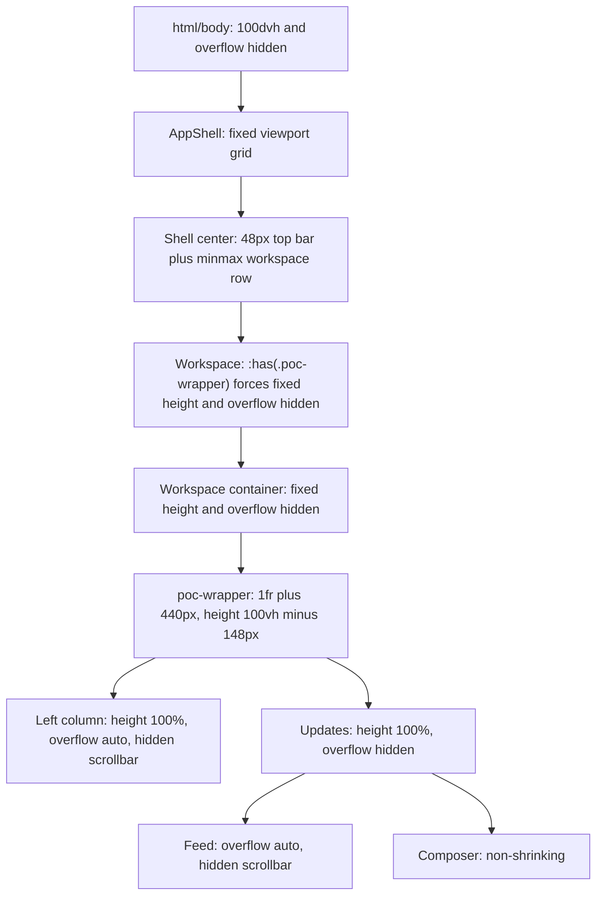
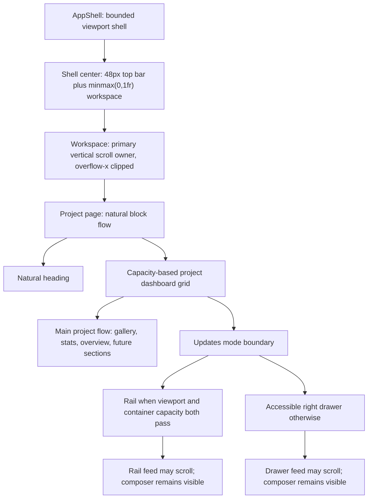

# Project Dashboard Responsive Correction Plan

Plan date: 1 August 2026  
Target route: `/projects/[projectId]`  
Status: proposed for review, no production implementation has started

## 1. Authority and scope

This plan is controlled by:

- `docs/audits/project-dashboard-responsive-audit.md`;
- `docs/audits/project-dashboard-responsive-audit-verification.md`;
- `docs/audits/project-dashboard-responsive/dashboard-verification-measurements.json`;
- the 29 PNG files in `docs/audits/project-dashboard-responsive/`;
- the approved product decisions supplied with this planning request;
- `PRODUCT.md` and the current source tree for product register and component boundaries.

The correction is a responsive architecture change, not a visual redesign. It preserves Hanken Grotesk, the restrained Kallisto visual language, project content, route behavior, and existing update interactions. It does not change project permissions, persistence, domain rules, route/tab semantics, or the below-640 mobile product decision.

### Non-negotiable outcomes

1. Primary project content wins every width-budget decision.
2. Updates is a 340 to 400px rail only when the main project area remains at least 680px, with 720px preferred.
3. Below 1200px, Updates is a right-side drawer and is never stacked below the gallery.
4. `.workspace` is the primary vertical scroll owner for the project page.
5. `.poc-left-column` does not scroll vertically or horizontally.
6. The page has no fixed viewport-subtraction height and no fixed grid rows.
7. Statistics respond to their rendered container.
8. Gallery height responds to both inline capacity and viewport height.
9. Dynamic text, media, and composer content remain contained.
10. Typography stays at its existing computed scale.

## 2. Architecture before and after

### Before

Consequences: the document and workspace cannot recover clipped content; the left project column, feed, and sidebar become separate scroll owners; the 1100px one-column override creates fixed-height tracks; the 440px Updates rail competes directly with the main project workspace.

### After

The shell may remain viewport-bounded so the top bar and side navigation retain their established behavior. The critical change is that the project `.workspace` scrollport owns vertical page movement and the project content below it grows naturally.

## 3. Shared responsive contract

### 3.1 Capacity constants

Add one typed source for JS layout decisions at `lib/layout/responsive-contract.ts`. The CSS should consume resulting data attributes and shared CSS custom properties rather than reimplementing the same mode decisions in unrelated media queries.

| Contract value | Proposed value | Reason |
|---|---:|---|
| Project wide-shell threshold | 1440px | Smallest approved width that supports expanded 240px sidebar, 360px Updates, 24px gap, and at least 720px main content |
| Updates viewport threshold | 1200px | Approved boundary below which Updates is always a drawer |
| Updates container capacity | 1044px | 680px main minimum + 24px gap + 340px Updates minimum |
| Main minimum / preferred | 680px / 720px | Approved content priority |
| Updates min / preferred / max | 340px / 360px / 400px | Approved rail range |
| Dashboard column gap | 24px | Preserves the current visual rhythm |
| Wide/standard page padding | 24px each side | Preserves desktop alignment |
| Drawer-state page padding | 20px each side | Recovers useful main width below 1200 without scaling typography |
| Updates drawer width | `min(400px, viewport minus 32px)` | Keeps the drawer useful at 1024 while preserving an outside close target/backdrop |
| Gallery minimum / maximum | 280px / 460px | Protects content on short screens while preserving current wide-desktop scale |
| Composer textarea minimum / proposed maximum | 48px / 144px | Approximately two to six text lines before an explicit internal scrollbar |

Mode selection is conjunctive:

- rail only when viewport width is at least 1200px **and** the measured dashboard container is at least 1044px;
- drawer at any smaller viewport or smaller measured container;
- an open Odin panel can therefore force Updates from rail to drawer without shrinking main content below 680px;
- the project AppShell profile uses an expanded sidebar from 1440px upward and the compact rail below 1440px, unless the user explicitly collapses it earlier.

### 3.2 Width-budget formula

The default closed-Odin budget uses the existing 8px shell padding and 8px shell gap:

- center width = viewport − sidebar − 24px shell reserve;
- dashboard width = center − horizontal page padding;
- persistent main width = dashboard − Updates − 24px dashboard gap;
- drawer main width = full dashboard width.

The table is a target contract, not a promise of subpixel equality. A ±4px tolerance covers borders and browser rounding.

| Viewport | Sidebar | Centre | Page padding | Dashboard | Updates | Main | Expected mode |
|---|---|---:|---:|---:|---:|---:|---|
| 1920 | Expanded 240 | 1656 | 24 + 24 | 1608 | Rail 400 | 1184 | Wide desktop, persistent rail |
| 1536 | Expanded 240 | 1272 | 24 + 24 | 1224 | Rail ≈369 | ≈831 | Wide desktop, persistent rail |
| 1440 | Expanded 240 | 1176 | 24 + 24 | 1128 | Rail 360 | 744 | Minimum wide desktop, persistent rail |
| 1366 | Compact 56 | 1286 | 24 + 24 | 1238 | Rail ≈355 | ≈859 | Standard laptop, persistent rail |
| 1280 | Compact 56 | 1200 | 24 + 24 | 1152 | Rail 340 | 788 | Standard laptop, persistent rail |
| 1200 | Compact 56 | 1120 | 24 + 24 | 1072 | Rail 340 | 708 | Capacity floor, persistent rail |
| 1100 | Compact 56 | 1020 | 20 + 20 | 980 | Drawer, up to 400 | 980 | Main-only page plus Updates drawer |
| 1024 | Compact 56 | 944 | 20 + 20 | 904 | Drawer, up to 400 | 904 | Main-only page plus Updates drawer |

This removes the current failure where Updates is 47.93% of the dashboard at 1280 and restores the primary workspace from 454px to approximately 788px.

### 3.3 Odin interaction

Odin remains lower priority than the main project workspace. Updates is lower priority than both an explicitly opened Odin panel and the main workspace.

| State | Expected behavior |
|---|---|
| Odin closed | Use the width table above |
| Odin docked and dashboard container remains ≥1044px | Updates may remain a rail |
| Odin docked and dashboard container falls below 1044px | Updates changes to drawer; main remains ≥680px |
| Odin would reduce main below 680px even with Updates in drawer | Odin must use its existing overlay presentation rather than a docked third column |
| Odin below 1200 | Overlay, consistent with the page's drawer-first compact state |

The current `max-width:1160px` Odin overlay boundary is not sufficient by itself. Phase 2 must make docking capacity-aware or raise its project-profile threshold. The exact cross-route Odin docking policy remains an approval item because Odin is a shared shell feature.

## 4. Scroll ownership before and after

| Region | Before | After |
|---|---|---|
| `html/body` | Fixed, overflow hidden | Remains shell-bounded; must never gain horizontal overflow |
| `.app-shell` | Fixed viewport, overflow hidden | Remains bounded; grid rows/columns use `minmax(0,1fr)` |
| `.workspace` | Normally scrollable, but dashboard `:has()` changes it to hidden | **Primary project vertical scroll owner** with native platform scrollbar and `overflow-x:clip` |
| `.workspace-container` | Height 100%, overflow hidden for dashboard | Natural height; project page class scopes its layout without parent `:has()` |
| `.route-content-wrap` | Width only; dashboard relies on wrapper height | Natural block flow, `min-width:0` |
| `.poc-wrapper` | Fixed height, hidden overflow, fixed side rail | Natural-height capacity grid; no page scrolling of its own |
| `.poc-left-column` | Independent vertical and horizontal scroll, hidden scrollbar | `overflow:visible`, natural height, no independent scroll |
| Updates rail | Fixed-height right column | Sticky bounded panel; feed is the intentional internal owner |
| Updates drawer | Does not exist | Modal right drawer; feed is the intentional internal owner |
| Updates composer | Non-shrinking beneath feed | Non-shrinking; textarea auto-grows to maximum then shows a recognisable internal scrollbar |
| Sidebar navigation | Independent when content exceeds height | Preserved |

Keyboard expectation: Page Down, Space, Arrow keys, and wheel gestures from project content should move `.workspace`. The drawer traps focus while open; Escape closes it and focus returns to the Updates trigger.

## 5. Implementation phases and dependency order

The phases are ordered. Later phases may add tests earlier, but production changes should not be merged out of order when they depend on the new scroll or width contract.

### Phase 1: Shell and scroll ownership

#### Objective

Make `.workspace` the project page's only primary vertical scrollport and allow all main-project sections to participate in natural block flow.

#### Exact rule changes

In `app/globals.css`:

1. Keep `.shell-center { grid-template-rows: var(--topbar-height) minmax(0,1fr); }` at lines 117-126 and add regression coverage. It is already the correct shell primitive.
2. Replace `.workspace` lines 802-809 with a standard scrollport contract: `min-width:0`, `min-height:0`, vertical auto overflow, horizontal clipping, and platform-native scrollbar behavior. Remove `scrollbar-width:none`, `-ms-overflow-style:none`, and the WebKit scrollbar suppression at lines 815-817.
3. Remove only `.workspace:has(.poc-wrapper)` from the grouped fixed-height selector at lines 833-844. Leave schedule, tasks, and documents selectors unchanged until their own migrations.
4. Remove only `.workspace-container:has(.poc-wrapper)` from the grouped height/overflow selector at lines 846-856.
5. Do not add `.poc-wrapper` to the `.route-content-wrap:has(...)` fixed-height group at lines 859-869.
6. Replace `.poc-wrapper` lines 2522-2533: remove `flex:1`, `height:calc(100vh - 148px)`, `max-height:calc(100vh - 148px)`, and `overflow:hidden`; retain grid, width, gap, and `min-width` safeguards with natural height.
7. Replace `.poc-left-column` lines 2542-2551: remove `height:100%`, `overflow-y:auto`, right padding used for the hidden scrollbar, and scrollbar suppression. Use natural block flow and `min-width:0`.
8. Remove the project-specific fixed stack at lines 3032-3040. No complete Updates column is placed in a second grid row.
9. Replace `.poc-right-column` lines 3080-3089 with the rail/drawer panel contract from Phase 6. Remove `height:100%`, `max-height:100%`, and its blanket overflow clipping.
10. Keep feed scrolling intentional, but remove hidden-scrollbar declarations from `.poc-sections-card` lines 3091-3102. Use a platform scrollbar and `overscroll-behavior:contain`.

#### Component changes

- Add an optional page class/variant to `components/ui/route-page-container.tsx` so `ProjectDetailWorkspace` can render `project-dashboard-page` directly. Do not use a parent `:has()` selector to infer the route.
- Pass that project-page variant from `features/projects/project-detail-workspace.tsx`.
- Review `components/layout/main-workspace.tsx` for route-navigation focus. If keyboard tests require it, add `tabIndex={-1}` and focus the main landmark on project-route navigation without putting the scrollport in the normal Tab order.
- Keep `html/body` and `.app-shell` viewport-bounded. Their role is the application shell; the defect is the suppressed workspace, not the existence of a bounded shell.

#### Regression risk

The grouped `:has()` rules also control Schedule, Tasks, and Documents. Removing only the `.poc-wrapper` member is mandatory. Tests must prove those other selectors and routes retain their present scrolling behavior. Making the base workspace scrollbar native is a shared-shell visual change and requires a route sweep.

#### Phase acceptance

- Wheel, trackpad-equivalent input, Page Down, and Space over main project content change `.workspace.scrollTop`.
- `.poc-left-column.scrollTop` and horizontal scroll range remain zero.
- Project Overview and a future-section sentinel are reachable by the main workspace scroll.
- `document.scrollWidth === document.clientWidth` at every required viewport.

### Phase 2: Responsive width contract

#### Objective

Replace the 1320/1160/1100 breakpoint chain with project-capacity states that guarantee main-content priority.

#### Component and state changes

1. Add `lib/layout/responsive-contract.ts` for named values and pure capacity calculations.
2. Add a project-specific layout profile prop to `components/layout/app-shell.tsx`. The project route uses a 1440px automatic compact-sidebar boundary; other routes retain their existing default until separately migrated.
3. Replace the hard-coded `matchMedia("(max-width:1160px)")` project behavior at `app-shell.tsx:64-77` with the shared project-profile threshold. Keep manual collapse available on wide screens.
4. Add `features/documents/hooks/use-project-dashboard-layout.ts`. It observes the rendered dashboard inline size with `ResizeObserver`, combines it with the 1200px product boundary, and returns `rail` or `drawer`. Default safely to `drawer` until measured so initial rendering never starves the main area.
5. Apply `data-updates-mode="rail|drawer"` to the dashboard layout. CSS keys off this state rather than repeating an unrelated `max-width:1100px` stack.
6. Treat an Odin-induced container reduction exactly like any other capacity reduction. The observer moves Updates to drawer before main width falls below 680px.

#### CSS changes

- Replace `.poc-wrapper { grid-template-columns:minmax(0,1fr) 440px; }` at line 2524 with a data-state contract. Rail state uses `minmax(680px,1fr) minmax(340px,var(--updates-width))`; drawer state uses one `minmax(0,1fr)` column and does not render Updates as a grid row.
- Define `--updates-width` as a state-specific clamped value: 360 to 400px in wide mode and 340 to 360px in standard-laptop mode.
- Retain the 24px dashboard gap only in rail mode.
- Remove project dependence on the `max-width:1320px` container width rule at lines 1607-1614. The explicit `project-dashboard-page` class uses the padding contract from the width table.
- Remove the `.poc-wrapper` `max-width:1100px` stack override at lines 3032-3040.
- Do not reduce typography, apply zoom, or scale the page.

#### Boundary tests

Test 1439/1440, 1199/1200, dashboard container 1043/1044, and Odin open/closed. Both sides of each boundary must be valid even though the mode changes.

#### Phase acceptance

- Main width is at least 680px whenever Updates is a rail.
- Updates is never more than 400px and is never approximately equal to main width.
- At 1100 and 1024 there is no Updates grid row.
- Opening Odin cannot silently compress the main project area below its minimum.

### Phase 3: Project content flow

#### Objective

Make the heading, gallery, statistics, overview, and future sections one natural, ordered page flow.

#### Exact component changes

- `features/documents/components/project-overview-card.tsx`: reduce responsibility to the dashboard layout and left-content composition. The left side remains ordered as gallery, statistics, Project Overview, then future project sections.
- `features/documents/components/project-overview-section.tsx`: keep its current expand/collapse behavior, but ensure the expanded body contributes natural height and no ancestor clips it.
- `components/ui/route-page-container.tsx`: remove the assumption that a heading is always 36px. Give the heading a natural block size and preserve the existing 16px separation from content.
- `features/documents/components/documents-title-row-actions.tsx`: keep route links and order unchanged. Allow the containing heading to place this group on a second row when capacity is insufficient.

#### Exact CSS changes

- Replace `.page-heading` lines 871-880: remove fixed `height:36px` and `flex-shrink:0`; use natural grid/flex rows.
- Replace `.page-heading-left` lines 890-900 with `minmax(0,1fr)` title capacity plus an auto-sized actions region. It may wrap to two rows at a component-capacity boundary.
- Remove `.page-heading-title { flex-shrink:0; }` at lines 910-914. The title wrapper must be `min-width:0`.
- Keep the current 22px project title and 13px action typography.
- Ensure `.route-content-wrap` at lines 2090-2092 has `min-width:0` and natural height.
- Avoid `order` changes that alter keyboard or screen-reader reading order.

#### Future-section contract

Every future section appended after Project Overview must participate in the same DOM and visual order, contribute natural block height, and become reachable through `.workspace`. No future section may introduce a page-level fixed height without a separate reviewed exception.

#### Phase acceptance

- Expanded Overview and a future dummy section are reachable at 1024×768.
- Heading growth pushes content down rather than covering it.
- No fixed row track appears in computed `grid-template-rows`.

### Phase 4: Gallery policy

#### Chosen sizing model

Use the main-content container as the inline-size reference and the small viewport height as the vertical cap. The intended block-size model is a 2:1 preview constrained between 280 and 460px and capped near 44svh. Implement it with modern container-relative sizing after the dashboard establishes an inline-size container; provide a standards-based non-container fallback, not a browser-specific hack.

Normal preview uses `object-fit:cover`. Fullscreen uses `object-fit:contain` so the entire image can be inspected. Neither mode changes the image's intrinsic aspect ratio.

| Viewport | Expected gallery width | Expected height range | Governing constraint |
|---|---:|---:|---|
| 1920×1080 | 1180 to 1184 | 440 to 460 | Wide-screen maximum |
| 1536×864 | 827 to 831 | 370 to 385 | 2:1 width and 44svh cap converge |
| 1440×900 | 740 to 744 | 360 to 380 | 2:1 container behavior |
| 1366×768 | 855 to 859 | 328 to 344 | Short-laptop height cap |
| 1280×720 | 784 to 788 | 304 to 320 | Short-laptop height cap |
| 1200×800 | 704 to 708 | 340 to 356 | 2:1 width / height cap |
| 1100×800 | 976 to 980 | 340 to 356 | Drawer mode; height cap prevents width-driven growth |
| 1024×768 | 900 to 904 | 326 to 342 | Drawer mode; short-height cap |

#### Exact changes

- `app/globals.css:2928-2937`: replace the fixed `aspect-ratio`, `min-height`, and `max-height` combination with the container-and-viewport policy.
- Remove the project-frame height override in the `max-width:1400px` block at lines 3026-3029.
- Remove the now-unreachable `max-width:720px` project frame sizing at lines 3072-3075 from this desktop/tablet correction; the mobile guard remains a separate product constraint.
- `features/documents/components/gallery/project-gallery-viewer.tsx`: accept optional focal metadata from `GalleryImage` and expose it through a CSS custom property or typed class. Default to center only when no approved focal point exists.
- Preserve absolute top-right overlay controls inside the frame. Increase interactive hit areas in Phase 8 without increasing icon scale.
- Reset zoom on image change and fullscreen exit; keep zoom transform scoped to the image.

#### Focal/crop policy

Each gallery image may define an `objectPosition` or normalized focal point. The preview may crop around that point; fullscreen must reveal the whole image. Existing Nila Residence asset focal coordinates still require design approval, so implementation should default to center until approved rather than invent a subject position.

#### Phase acceptance

- Measured dimensions stay within the table tolerances.
- No gallery exceeds 44% of a short viewport unless the 280px minimum controls.
- Natural image ratio is unchanged; normal crop and fullscreen contain behavior are visually verified.
- Controls remain inside the frame and do not cover unrelated content.

### Phase 5: Statistics responsiveness

#### Evaluation

| Approach | Assessment |
|---|---|
| Viewport media queries | Rejected. They caused `RSP-002` because the component was 454 to 588px while the viewport remained above 1200px. |
| `auto-fit/minmax()` only | Better than the current rule, but intrinsic long values can still create unpredictable column counts and awkward orphan behavior. |
| Explicit component-width breakpoints using container queries | **Chosen.** Predictable five-card order, testable thresholds, and direct response to the rendered component. |

#### Proposed container contract

- Add `container-type:inline-size` to the statistics wrapper.
- Five columns at 680px and above.
- Three columns from 480 to 679px.
- Two columns from 320 to 479px.
- One column below 320px.
- Use `minmax(0,1fr)` in every state; every card and text wrapper keeps `min-width:0`.
- Preserve DOM/reading order: Start Date, Duration, Built-up Area, Budget, Client.

#### Exact changes

- Remove viewport rules at `app/globals.css:2563-2573`.
- Replace `repeat(5,1fr)` at lines 2555-2561 with the container-query default/overrides.
- In `.horiz-stat-card` and `.horiz-stat-info` at lines 2575-2610, prevent intrinsic content from widening the track.
- Replace the unconditional single-line ellipsis at `.horiz-stat-value` lines 2619-2627 with the Phase 7 per-value policy.
- Refactor `features/documents/components/project-stat-cards-bar.tsx` so cards accept typed values from the project view model rather than keeping responsive test cases trapped in local constants. Preserve the current icons, labels, order, and colors during this correction.

#### Phase acceptance

- The grid has zero horizontal scroll at every required viewport and every long-value fixture.
- Every card is present and readable in DOM order.
- Five columns remain at all proposed main widths because the approved width contract keeps main at or above 680px; narrower component states remain covered for Odin/future embedding.

### Phase 6: Updates rail and drawer

#### Extraction decision

Extract the **currently rendered** embedded Updates state and markup from `ProjectOverviewCard` into a dedicated responsive component. Do not replace it with `features/projects/components/project-updates-feed.tsx` in this correction. That separate feature uses a different repository, URL filters, pagination, composer, local draft persistence, and interaction set; swapping it in would be a behavior/data migration rather than a responsive correction.

The later convergence of the two Updates implementations should be a separate architecture task after route ownership in `RSP-015` is approved.

#### Proposed component boundary

- New `features/documents/hooks/use-project-updates-panel-state.ts`: owns the current `updatesList`, draft, attachments, mentions/actions/audience state, and handlers once at the persistent dashboard boundary so responsive presentation changes cannot reset them.
- New `features/documents/components/project-updates-panel.tsx`: receives that typed controller and renders posts, empty state, feed, and composer without owning layout-mode state.
- New `features/documents/components/project-updates-drawer.tsx`: adapts the panel to a controlled right drawer without duplicating feed state or DOM.
- New reusable `components/ui/drawer.tsx`: use the native `<dialog>` modal behavior as the base, with a right-side visual treatment, labelled header, close button, Escape handling, focus containment, and focus restoration.
- New `features/projects/components/project-dashboard-header-actions.tsx`: composes `DocumentsTitleRowActions` with an Updates trigger when the layout mode is `drawer`.
- `features/projects/project-detail-workspace.tsx`: owns `updatesOpen`, renders the trigger in the project heading, and passes controlled open/close state to the dashboard.
- `features/documents/components/project-overview-card.tsx`: owns layout mode measurement, one persistent Updates controller hook, main content composition, and placement of the extracted presentation.

#### Rail behavior

- Render as a labelled complementary `<aside>` only in rail mode.
- Width follows the 340 to 400px contract.
- Use `position:sticky` within the `.workspace` scrollport so Updates remains available while main content scrolls.
- Bound only the rail panel, not the page. A tokenized rail-specific maximum may reference the shell scrollport; do not restore a fixed height to `.poc-wrapper`.
- Panel uses `display:flex; flex-direction:column; min-height:0`.
- Feed uses `flex:1 1 auto; min-height:0; overflow-y:auto`; native scrollbar remains visible when a range exists.
- Composer is `flex:0 0 auto` beneath the feed.

#### Drawer behavior

- Trigger location: trailing end of the project heading action group, after the existing Task/Drive/BOQ/Finance/Site links. It is shown only in drawer mode and uses the visible label “Updates”.
- Trigger exposes `aria-haspopup="dialog"`, `aria-expanded`, and the drawer id.
- Optional unread badge is rendered only from an authoritative `unreadCount` prop. Do not derive or invent unread state from the current three mock posts.
- Drawer opens from the right, width up to 400px, with a labelled header and close button of at least 40×40px.
- Opening moves focus to the drawer heading or close control. Tab and Shift+Tab remain inside. Escape closes. Closing returns focus to the exact trigger.
- Backdrop click may close only when it cannot cause accidental draft loss. If a non-empty draft exists, require explicit close confirmation or retain the draft in component state.
- Feed is the drawer's only main vertical scroll owner. Composer remains at the bottom and is not covered by the viewport or virtual keyboard.
- Do not mount simultaneous rail and drawer copies. The persistent controller remains mounted while the single presentation switches containers, preserving feed/composer state across layout-mode changes.

#### Content states

- Empty: preserve the current composer and show a restrained instructional empty state in the feed region.
- Many updates: 12+ updates stay in the feed owner; do not expand the drawer/page horizontally. Pagination/virtualization is out of scope unless performance measurements require it.
- Long text: use Phase 7 wrapping.
- Portrait/wide media: one consolidated 16:9 preview with `object-fit:cover`; full media remains available through the existing detail/fullscreen interaction if present. No stretching.
- Composer: auto-growth from 48 to proposed 144px, then a visible textarea scrollbar.

#### Phase acceptance

- Rail exists only when both capacity tests pass.
- Drawer is not placed below gallery in DOM or visual flow.
- Keyboard tests prove trap, Escape close, focus restoration, and labelled controls.
- Switching rail/drawer does not lose a typed draft or reset the feed.
- Zero, three, and twelve-update fixtures all preserve feed/composer geometry.

### Phase 7: Content resilience

| Finding/content | Policy | Exact behavior |
|---|---|---|
| `RSP-016` project title | Wrap, then clamp | `min-width:0`; wrap up to two lines with `overflow-wrap:anywhere`; move actions to a second row when capacity is insufficient. If clamped after two lines, expose the full name on hover/focus and in the accessible heading name. |
| `RSP-017` breadcrumbs | Collapse + truncate | Represent breadcrumb items structurally. Collapse least-important intermediate parents into a keyboard-accessible ellipsis menu; keep the current item, truncate it with ellipsis, and expose full path text. Search/actions never surrender their minimum widths. |
| `RSP-018` workspace name | Truncate + popover | Keep the dense selector row one line with ellipsis. Put the complete name in the switcher popover and accessible trigger name; add the standard hover/focus tooltip only when measured overflow exists. |
| `RSP-019` unbroken update | Word break | `overflow-wrap:anywhere; word-break:normal; min-width:0; max-width:100%`. Links and attachment names receive the same containment. |
| `RSP-020` multiline composer | Auto-grow | Grow from 48 to proposed 144px based on `scrollHeight`; after the cap, set vertical auto overflow and show the platform scrollbar. Reset height after submit/clear. |
| Long client name | Wrap, then disclose | Natural wrap up to two lines. If still longer, clamp visually and expose the complete value through an accessible tooltip/popover. |
| Long built-up area/budget | Wrap at semantic boundaries | Keep number/unit/currency groups intact where possible; allow a second line at spaces. Use tabular numerals. Never scroll horizontally or hide digits silently. |
| Long navigation label | Truncate + tooltip | Keep the 32px dense navigation row; single-line ellipsis with full accessible name and hover/focus tooltip on actual overflow. |
| Long normal update paragraphs | Wrap naturally | Preserve paragraphs and spacing; feed height grows, not width. |
| Portrait/wide update media | Crop preview, reveal full media | Consistent preview ratio with cover, centered or metadata focal point; never distort. |

#### Exact source changes

- `components/ui/route-page-container.tsx` and `app/globals.css:871-1015` for title structure.
- `components/layout/top-bar.tsx` and `app/globals.css:533-674` for breadcrumb capacity. Refactor `BreadcrumbNav` to emit structured items with priority metadata; add `components/layout/breadcrumb-overflow-menu.tsx` if a menu is required.
- `components/layout/sidebar-expanded.tsx:50-62`, `77-88`, and `app/globals.css:229-243`, `306-308` for workspace/nav disclosure.
- Extracted Updates post styles from `app/globals.css:4042-4047` for long-token containment.
- Extracted composer behavior from `project-overview-card.tsx:759-773` and styles at `app/globals.css:3401-3438` for auto-growth and focus.
- `project-stat-cards-bar.tsx` plus `.horiz-stat-value` at `app/globals.css:2619-2627` for typed value policies.

#### Phase acceptance

Each audit fixture must have zero overlap and zero horizontal scroll. Truncation is accepted only when the full value has a keyboard-accessible disclosure path.

### Phase 8: Accessibility and CSS cleanup

#### Controls and focus

- Use a minimum 40×40px interactive hit area for gallery controls, drawer controls, send/upload/audience controls, and compact header actions. Keep the existing icon size and restrained visual density inside the larger hit box.
- Remove `border:none!important`, `outline:none!important`, and `box-shadow:none!important` from the composer focus rules at `app/globals.css:3414-3434` where they suppress focus.
- Add a visible shared `:focus-visible` treatment and composer-card `:focus-within` state using existing Kallisto focus tokens.
- Give the textarea a persistent programmatic label. Keep placeholder copy as guidance, not as its accessible name.
- Add explicit accessible names to upload, audience, action, send, gallery, breadcrumb-overflow, Updates trigger, and drawer close controls.

#### Contrast and clipping

- Replace `.post-date { color:#3B82F6; }` at lines 3987-3990 with a semantic strong-link/information text token that measures at least 4.5:1 on every update surface. Reuse the existing darker blue family where it passes; validate computed contrast rather than selecting by appearance.
- Allow the sidebar invitation copy at `sidebar-expanded.tsx:99-108` and `globals.css:337-380` to wrap or gain a small width tolerance so 169px content is not placed in a 167px text box.

#### Duplicate and token cleanup

- Consolidate `.post-media-banner` at `app/globals.css:3104-3114` and `4050-4058` into one rule beside the extracted Updates component. Remove the losing duplicate.
- Migrate direct colors/dimensions touched by this work to semantic tokens. Do not attempt a global stylesheet redesign in the same change.
- Keep existing Hanken type sizes and weights. Do not use fluid typography or globally smaller text.
- Do not create custom-styled scrollbars. Restoring the platform scrollbar is sufficient.

#### Phase acceptance

- All interactive controls have visible keyboard focus and accessible names.
- Update date contrast is at least 4.5:1.
- Invitation copy has no clipping.
- Only one authoritative media-banner sizing rule remains.
- A source sweep finds no CSS zoom, transform-based page scaling, or browser-specific responsive workaround.

### Phase 9: Automated and manual regression testing

#### Test foundation

The repository has Vitest/Testing Library but no Playwright dependency, config, or `test:e2e` script. Add:

- `@playwright/test` as a development dependency;
- `playwright.config.ts` with the repository dev/start command and screenshot/trace retention on failure;
- `test:e2e` in `package.json`;
- `tests/e2e/project-dashboard-responsive.spec.ts`;
- `tests/e2e/helpers/project-dashboard-assertions.ts`;
- `tests/e2e/fixtures/project-dashboard-content.ts` for deterministic text/media fixture values;
- `tests/unit/project-dashboard-layout-contract.test.ts` for capacity calculations;
- `tests/unit/project-updates-panel.test.tsx` for rail/drawer state and accessibility;
- updates to `tests/app-shell.test.tsx` for the project layout profile and Odin interactions.

Do not add a production-only query parameter or hidden route to select test fixtures. Production components should accept typed view data as normal props. Component tests pass fixture variants directly. Playwright may use a controlled DOM text/media substitution helper for pure overflow stress, while the default route and all interactive behavior remain the real React application.

#### Required viewport matrix

| Viewport | Default/Odin closed | Odin open | Primary assertions |
|---|---|---|---|
| 1920×1080 | Rail | Rail if capacity passes | Expanded sidebar; Updates ≤400; main ≥680 |
| 1536×864 | Rail | Drawer if docked Odin removes capacity | Expanded sidebar; height-capped gallery |
| 1440×900 | Rail | Drawer when capacity fails | Expanded boundary; main ≈744 |
| 1366×768 | Rail | Drawer when capacity fails | Compact sidebar; short-laptop gallery |
| 1280×720 | Rail | Drawer when capacity fails | Main ≈788; no stat/left scroll |
| 1200×800 | Rail | Drawer when capacity fails | Exact rail floor; main ≈708 |
| 1100×800 | Drawer | Drawer; Odin overlay | No Updates row; main full width |
| 1024×768 | Drawer | Drawer; Odin overlay | Main flow fully reachable |

#### Structural assertions at every viewport

- `document.documentElement.scrollWidth === clientWidth`;
- `.workspace.scrollHeight >= clientHeight` when content exceeds the viewport and is the element whose `scrollTop` changes;
- `.poc-left-column.scrollWidth === clientWidth` and `scrollHeight === clientHeight`;
- no statistics horizontal range;
- no element bounding box crosses another assigned region or viewport edge;
- persistent rail width is 340 to 400px and main width is at least 680px;
- drawer mode has no visible/laid-out Updates grid column or second row;
- Page Down/Space from project content scrolls `.workspace`;
- typography computed values match the verified baseline;
- gallery dimensions remain inside the Phase 4 ranges;
- image CSS is cover in preview and contain in fullscreen, with no stretched geometry.

#### Content fixtures

Run every fixture at a rail state (1280×720) and drawer state (1100×800 or 1024×768). Run heading/breadcrumb fixtures additionally at the 1440 and 1200 boundaries.

1. Default content.
2. Very long project title.
3. Long breadcrumb labels.
4. Long workspace name.
5. Long client, five-digit area, and large budget values.
6. Long unbroken update token.
7. Several update paragraphs.
8. Portrait update media.
9. Very wide update media.
10. No updates.
11. Twelve updates.
12. Multiline composer draft.
13. Expanded Project Overview plus a future section below it.
14. Odin open and closed.

#### Drawer interaction tests

- Trigger is present only in drawer mode and includes an optional unread badge only when a value is supplied.
- Enter/Space opens; focus moves inside.
- Tab and Shift+Tab cycle within the dialog.
- Escape closes; trigger regains focus.
- Background is inert while open.
- Feed scroll does not move the page; scrolling outside the drawer moves/retains the page as expected after close.
- Draft survives rail/drawer mode transition and close/reopen according to the approved draft-loss policy.

#### Visual regression snapshots

Capture stable viewport screenshots for all eight default states, both sides of 1439/1440 and 1199/1200, 1024 drawer open, 1280 long-content rail, and Odin open at 1920/1536/1280/1024. Use focused crops for the heading, stats, gallery, rail/drawer, and composer so diffs remain reviewable.

Treat all 29 PNGs in `docs/audits/project-dashboard-responsive/` as immutable “before” evidence. Do not overwrite them with passing baselines. The verification report's screenshot index remains the issue-to-evidence map. In particular, compare the new implementation against:

- the eight `dashboard-*-viewport.png` captures for shell/typography/identity continuity;
- the five `rsp-001` through `rsp-005` crops for removal of the P1 failure geometry;
- `dashboard-1024x768-left-scroll.png` and `dashboard-1024x768-feed-scroll.png` for changed scroll ownership;
- `dashboard-1280x720-stats-horizontal-scroll.png` for elimination of stat overflow;
- `rsp-016` through `rsp-020` content-stress screenshots for title, breadcrumb, workspace, long-token, and composer resilience.

Create new 1200×800 and 1100×800 pre-change captures before implementation because those required regression sizes do not exist in the original audit set.

#### Manual verification

After automated checks pass, repeat the eight viewports in the running app. Verify wheel, trackpad, Page Down, Space, Arrow keys, Tab order, focus visibility, drawer behavior, fullscreen gallery, browser console, and route navigation. Check Schedule, Tasks, Documents, Home, Team, and one other detail route for shared-shell regressions.

#### Required commands

1. `npm run typecheck`
2. `npm run lint`
3. `npm run test`
4. `npm run test:e2e`
5. `npm run build`

Report focused failures separately from unrelated repository-wide failures. Do not claim completion if any required responsive acceptance assertion fails.

## 6. Exact file plan

### Existing production files to change

| File | Planned responsibility | Phases |
|---|---|---|
| `app/projects/[projectId]/page.tsx` | Pass the project-dashboard AppShell profile; no route behavior change | 2 |
| `app/globals.css` | Remove dashboard height lock/nested scroll, establish data-mode grid, natural heading, gallery/container-query stats, content containment, a11y, and duplicate cleanup | 1 to 8 |
| `components/layout/app-shell.tsx` | Project layout profile, coordinated compact-sidebar threshold, Odin capacity interaction | 2 |
| `components/layout/main-workspace.tsx` | Main scroll landmark/focus support if keyboard testing requires it | 1 |
| `components/layout/top-bar.tsx` | Structured capacity-safe breadcrumbs | 7 |
| `components/layout/sidebar-expanded.tsx` | Full workspace/nav disclosure and invitation clipping | 7, 8 |
| `components/ui/route-page-container.tsx` | Explicit project page class/variant and natural heading layout | 1, 3, 7 |
| `features/projects/project-detail-workspace.tsx` | Own Updates drawer open state; compose project heading actions; pass typed project/dashboard data | 2, 6 |
| `features/documents/components/documents-title-row-actions.tsx` | Compose with Updates trigger and remain valid on wrapped heading row | 3, 6 |
| `features/documents/components/project-overview-card.tsx` | Remove embedded Updates responsibility; natural main flow and mode boundary | 1, 2, 3, 6 |
| `features/documents/components/project-overview-section.tsx` | Verify natural expanded height and future-section flow | 3 |
| `features/documents/components/project-stat-cards-bar.tsx` | Typed values, container ownership, long-value behavior | 5, 7 |
| `features/documents/components/gallery/project-gallery-viewer.tsx` | Height/focal policy, preview cover/fullscreen contain, control hit areas | 4, 8 |
| `features/documents/components/gallery/project-gallery.tsx` | Pass focal metadata and preserve image order | 4 |
| `tests/app-shell.test.tsx` | Project-profile sidebar and Odin mode coverage | 2, 9 |
| `package.json` | Add `test:e2e` and Playwright dependency | 9 |

### New production files

| File | Purpose |
|---|---|
| `lib/layout/responsive-contract.ts` | Named thresholds, widths, and pure capacity decision helpers |
| `features/documents/hooks/use-project-dashboard-layout.ts` | ResizeObserver-based rail/drawer mode using the shared contract |
| `features/documents/hooks/use-project-updates-panel-state.ts` | Persistent current Updates/feed/composer state and handlers across layout modes |
| `features/documents/components/project-updates-panel.tsx` | Extracted current Updates/feed/composer behavior, rendered once |
| `features/documents/components/project-updates-drawer.tsx` | Controlled responsive adapter for the panel |
| `features/projects/components/project-dashboard-header-actions.tsx` | Existing project navigation plus drawer trigger/unread slot |
| `components/ui/drawer.tsx` | Accessible native-dialog-based right drawer primitive |
| `components/layout/breadcrumb-overflow-menu.tsx` | Only if structured breadcrumb collapsing cannot remain cleanly inside `top-bar.tsx` |

### New test files

| File | Purpose |
|---|---|
| `playwright.config.ts` | Browser projects, server startup, trace/screenshot policy |
| `tests/e2e/project-dashboard-responsive.spec.ts` | Required viewport, content, input, Odin, rail, drawer, and screenshot suite |
| `tests/e2e/helpers/project-dashboard-assertions.ts` | Reusable geometry, scroll-owner, overlap, typography, and overflow assertions |
| `tests/e2e/fixtures/project-dashboard-content.ts` | Typed stress strings/media metadata used by tests |
| `tests/unit/project-dashboard-layout-contract.test.ts` | Boundary and capacity calculations |
| `tests/unit/project-updates-panel.test.tsx` | Empty/many updates, draft persistence across mode, drawer accessibility |

The existing `features/projects/components/project-updates-feed.tsx`, its composer/post/media components, repositories, and `tests/unit/project-updates-feed.test.tsx` are not replaced or deleted in this correction.

## 7. Selector removal and replacement ledger

| Current selector/rule | Action | Replacement contract |
|---|---|---|
| `.workspace:has(.poc-wrapper)` in `globals.css:833-844` | Remove this selector from group | Base `.workspace` owns project vertical scroll |
| `.workspace-container:has(.poc-wrapper)` in `846-856` | Remove this selector from group | Explicit `project-dashboard-page` class, natural height |
| `.poc-wrapper` `height/max-height:calc(100vh - 148px)` | Delete | Natural-height capacity grid |
| `.poc-wrapper` `overflow:hidden` | Delete | Main flow visible inside `.workspace` scrollport |
| `.poc-left-column` `height:100%; overflow-y:auto; scrollbar-width:none` | Delete | Natural block flow, `overflow:visible`, `min-width:0` |
| `.poc-wrapper` `grid-template-columns:minmax(0,1fr) 440px` | Replace | Data-mode capacity grid with 340 to 400px Updates |
| `@media(max-width:1100px)` complete project stack | Delete | Drawer mode below 1200/capacity threshold |
| `.poc-right-column` `height/max-height:100%; overflow:hidden` | Replace | Sticky rail or dialog drawer adapter |
| `.poc-sections-card` hidden scrollbar | Delete suppression | Intentional native-scroll feed |
| Stats `repeat(5,1fr)` + viewport 1200/600 rules | Replace | Container queries at 680/480/320 |
| Gallery fixed min/max and 1400/720 frame overrides | Replace | 280 to 460px, 2:1 container intent, 44svh cap |
| `.page-heading` fixed 36px | Replace | Natural rows |
| `.page-heading-title { flex-shrink:0 }` | Delete | `min-width:0`, two-line wrap/clamp |
| `.topbar-breadcrumbs { white-space:nowrap }` without bounds | Replace | Structured collapse/truncation with min-width safeguards |
| Composer `outline/border/shadow:none!important` | Delete focus suppression | Shared focus-visible/focus-within treatment |
| `.post-date { color:#3B82F6 }` | Replace | Contrast-verified semantic token |
| First and second `.post-media-banner` rules | Consolidate | One 16:9 preview rule in Updates section |

## 8. Finding coverage

| Finding | Resolving phase(s) |
|---|---|
| RSP-001 fixed Updates width | 2, 6 |
| RSP-002 statistics overflow | 2, 5, 7 |
| RSP-003 invalid stacked rows | 1, 2, 6 |
| RSP-004 height-insensitive gallery | 1, 4 |
| RSP-005 fragmented hidden scrolling | 1, 6 |
| RSP-006 breakpoint cliffs | 2 |
| RSP-007 gallery crop inconsistency | 4 |
| RSP-008 small hit areas | 8 |
| RSP-009 missing composer focus | 8 |
| RSP-010 date contrast | 8 |
| RSP-011 incomplete labels | 8 |
| RSP-012 sidebar invitation clipping | 8 |
| RSP-013 direct styling/tokens | 8, limited to touched rules |
| RSP-014 duplicate media sizing | 6, 8 |
| RSP-015 route/component ownership | 6 extracts responsive ownership only; route/tab redesign deferred |
| RSP-016 long title | 3, 7 |
| RSP-017 long breadcrumbs | 7 |
| RSP-018 long workspace name | 7 |
| RSP-019 unbroken update | 6, 7 |
| RSP-020 multiline composer | 6, 7, 8 |

## 9. Risks to shared pages and mitigations

| Risk | Affected surfaces | Mitigation / gate |
|---|---|---|
| Removing the wrong member of grouped `:has()` rules | Schedule, Tasks, Documents | Remove only `.poc-wrapper`; add route smoke tests before merge |
| Base workspace native scrollbar changes visual chrome | All scrollable routes | Use platform scrollbar, inspect major routes, avoid custom styling |
| RoutePageContainer heading changes global layout | Enquiries, Documents, BOQ, Finance, Site and other routes | Add long/default title component tests and representative route screenshots |
| Top-bar breadcrumb refactor changes all routes | Entire app shell | Data-driven breadcrumb tests for project, Gantt, standalone modules, enquiry/client detail |
| Project-specific compact-sidebar threshold leaks globally | Other AppShell routes | Use explicit `layoutProfile`; keep default profile unchanged |
| ResizeObserver causes hydration flicker or loop | Project page | Default to drawer, update only on discrete mode changes, test resize transitions |
| Odin and Updates drawers compete for focus/z-index | Project compact modes | One overlay priority policy; close or prevent opening the lower-priority surface; test focus restoration |
| Search, mobile navigation, developer console, Updates drawer stack | Shared overlays | Centralize drawer/dialog z-index tokens and assert only intended modal is interactive |
| Extracting Updates resets local component state | Current mock feed/composer | Mount one panel instance; test draft/feed state across rail/drawer transitions |
| Container queries unsupported by an approved browser | Statistics/gallery | Confirm browser support matrix; provide standards-based grid fallback with no horizontal overflow |
| Focal metadata absent | Gallery assets | Default center, require approved focal coordinates before per-image overrides |
| Mobile guard overlap | Below 640 | Do not modify guard in this correction; report as retained product constraint |

## 10. Acceptance checklist

### Architecture and scroll

- [ ] `.workspace` is the main project vertical scroll owner.
- [ ] `.poc-left-column` has no vertical or horizontal scroll range.
- [ ] `calc(100vh - 148px)` is absent.
- [ ] No fixed-height stacked rows exist.
- [ ] Project Overview and future content remain reachable.
- [ ] Sidebar and Updates feed retain only their intentional independent scrolling.
- [ ] Main scrollbar is visually recognisable through platform behavior.

### Width and responsive state

- [ ] Width budgets match the table within ±4px.
- [ ] Persistent Updates is 340 to 400px.
- [ ] Main project content is at least 680px whenever the rail is visible.
- [ ] Below 1200px, Updates is a drawer and never a second project row.
- [ ] Opening Odin never reduces main below 680px.
- [ ] No page or statistics horizontal overflow exists.

### Content and media

- [ ] Long title and breadcrumbs do not overlap controls.
- [ ] Long workspace/nav/stat values remain accessible.
- [ ] Unbroken update text remains inside the feed.
- [ ] Composer grows from minimum to approved maximum and then scrolls visibly.
- [ ] Gallery dimensions stay inside the viewport table ranges.
- [ ] Preview/fullscreen images never distort.
- [ ] Portrait and wide update media remain contained.

### Updates drawer

- [ ] Trigger location and label are consistent.
- [ ] Unread badge appears only with authoritative data.
- [ ] Focus enters and remains within the open drawer.
- [ ] Escape closes and focus returns to trigger.
- [ ] Feed scroll and composer placement work for zero, three, and twelve updates.
- [ ] Draft state survives responsive mode changes.

### Accessibility and quality

- [ ] Required controls provide at least 40×40px hit areas.
- [ ] Composer focus is visible.
- [ ] Update date contrast is at least 4.5:1.
- [ ] Composer and compact controls have durable accessible names.
- [ ] Sidebar invitation copy no longer clips.
- [ ] Only one media-banner sizing rule exists.
- [ ] Touched values use shared tokens where practical.
- [ ] Typography matches the verified baseline.

### Validation gates

- [ ] Typecheck passes.
- [ ] Lint passes.
- [ ] Unit/component tests pass.
- [ ] Responsive Playwright suite passes.
- [ ] Production build passes.
- [ ] Eight-viewport manual verification passes without new console errors.
- [ ] Shared Schedule, Tasks, Documents, Home, Team, and detail-route smoke checks pass.

## 11. Decisions still requiring approval

The primary responsive architecture is approved. These narrower decisions remain before their dependent implementation is finalized:

1. **Odin docking:** approve the proposed rule that Odin overlays whenever docking would leave main below 680px, and confirm whether this project-profile rule may later become shell-wide.
2. **Gallery focal points:** provide or approve focal coordinates for the current project images; otherwise center remains the documented fallback.
3. **Composer cap:** approve 144px (approximately six lines) as the maximum auto-grow height.
4. **Unread semantics:** identify the authoritative field/repository source and when an update becomes read. Until then, the trigger renders without a fabricated count.
5. **Draft close behavior:** choose between preserving the in-memory draft silently or confirming before backdrop/close dismissal when text is present. Recommended: preserve and restore without a blocking confirmation.
6. **Breadcrumb overflow:** approve the proposed ellipsis menu for hidden intermediate segments and single-line truncation for the current segment.
7. **Workspace/nav disclosure:** confirm the standard tooltip/popover treatment for text that is intentionally ellipsized in the dense sidebar.

None of these decisions permits weakening the approved main-width, drawer, natural-scroll, or no-overlap requirements.

## 12. Estimated implementation sequence

Effort is expressed as focused engineering days for one engineer and is not a calendar commitment. Product review time and unrelated repository failures are excluded.

| Sequence | Work package | Dependency | Estimated effort |
|---:|---|---|---:|
| 1 | Add layout contract tests and Playwright foundation skeleton | None | 0.5 to 1 day |
| 2 | Phase 1 shell/scroll ownership | Package 1 | 1 to 1.5 days |
| 3 | Phase 2 width/sidebar/Odin capacity contract | Phase 1 | 1 to 1.5 days |
| 4 | Phase 3 natural content/heading flow | Phases 1 and 2 | 0.5 to 1 day |
| 5 | Phase 4 gallery policy | Phase 3 | 0.5 to 1 day |
| 6 | Phase 5 statistics container queries | Phase 2 | 0.5 to 1 day |
| 7 | Phase 6 Updates extraction, rail, and accessible drawer | Phases 1 and 2 | 2 to 3 days |
| 8 | Phase 7 content resilience | Phases 3, 5, and 6 | 1 to 1.5 days |
| 9 | Phase 8 accessibility/token/CSS cleanup | Phases 4 to 7 | 1 to 1.5 days |
| 10 | Complete Phase 9 automated matrix, manual QA, and build | All prior packages | 1.5 to 2 days |

Expected total: approximately 9 to 14 focused engineering days.

Recommended delivery is a stack of reviewable changes:

1. **Shell contract PR:** phases 1 and 2 plus boundary tests.
2. **Main content PR:** phases 3, 4, and 5 plus gallery/stat visual evidence.
3. **Updates PR:** phase 6 plus drawer interaction tests.
4. **Hardening PR:** phases 7 and 8 plus full Phase 9 matrix and shared-route regression evidence.

Each PR must preserve the earlier contract. Do not merge the Updates drawer before the natural scroll and capacity boundary exist, and do not treat screenshot similarity alone as completion.

## 13. Completion report requirements

When implementation is eventually authorized and completed, the handoff must state:

- exact production and test files changed;
- which RSP findings each change resolves;
- rendered width and gallery measurements at all eight viewports;
- the observed scroll owner for page, feed, drawer, and sidebar;
- exact results of typecheck, lint, unit tests, Playwright, and build;
- desktop/tablet screenshots for rail, drawer, long-content, and Odin states;
- any remaining product decisions, limitations, or unrelated repository failures.

This document is the correction plan only. It does not authorize production edits.
